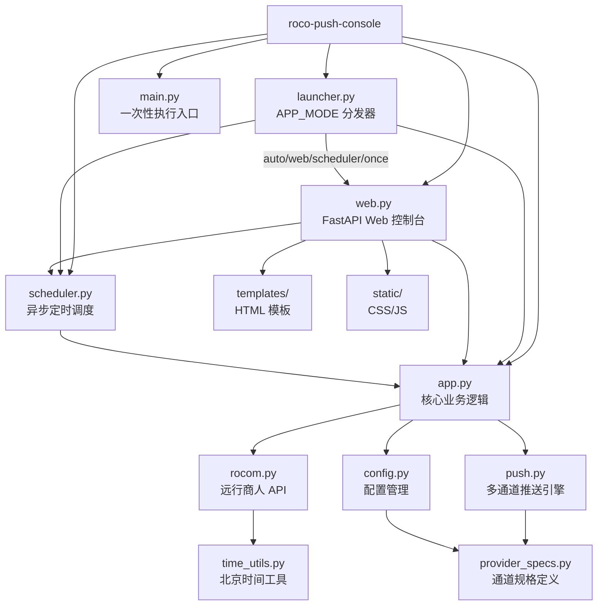

# roco-push-console

> 最后更新：2026-04-29 14:30:33

## 变更记录 (Changelog)

| 时间 | 变更内容 |
|------|---------|
| 2026-04-29 | 初始化项目文档，完整扫描 35 个文件，识别 10 个模块 |

---

## 项目愿景

监控《洛克王国世界》远行商人刷新状态的 Docker 常驻服务。提供 Web 控制台管理配置，支持自动托管模式（无控制台），并将刷新结果推送到微信、企业微信、飞书、钉钉、Bark、ntfy、Gotify 等 10 种推送通道。

---

## 架构总览

```
roco-serverchan-notifier/
├── src/roco_push_console/         # Python 包（核心逻辑）
│   ├── __init__.py                # 包初始化，版本号
│   ├── app.py                     # 核心业务：数据获取 → 推送
│   ├── config.py                  # 配置管理：Settings + ConfigStore
│   ├── push.py                    # 多通道推送引擎（10 种通道）
│   ├── rocom.py                   # 远行商人 API 客户端
│   ├── time_utils.py              # 北京时间工具
│   ├── provider_specs.py          # 通道类型规格定义
│   ├── scheduler.py               # 异步定时调度服务
│   ├── web.py                     # FastAPI Web 控制台
│   ├── launcher.py                # APP_MODE 解析与分发
│   ├── healthcheck.py             # Docker HEALTHCHECK
│   ├── templates/                 # HTML 模板
│   │   ├── login.html
│   │   └── index.html
│   └── static/                    # 前端静态资源
│       ├── login.css / login.js
│       └── console.css / console.js
├── tests/
│   └── test_core.py               # 单元测试（~30 个用例）
├── data/
│   └── config.json                # 运行时配置（含敏感信息！）
├── .github/workflows/
│   ├── ci.yml                     # CI：测试 + 编译检查
│   ├── docker-publish.yml         # Docker 镜像构建发布
│   └── scheduled-push.yml         # GitHub Actions 免费定时推送
├── docs/images/                   # 截图
├── main.py                        # 一次性执行入口
├── Dockerfile                     # 多阶段 Docker 构建
├── docker-compose.yml             # Docker Compose 配置
├── docker-entrypoint.sh           # 容器入口脚本
├── pyproject.toml                 # 项目元数据与依赖
├── .env.example                   # 环境变量模板
└── uv.lock                        # uv 依赖锁定
```

---

## 模块结构图



---

## 模块索引

| 模块 | 语言 | 职责 | 入口 | 行数 | 状态 |
|------|------|------|------|------|------|
| launcher.py | Python | APP_MODE 解析与分发（auto/web/scheduler/once） | `main()` | 55 | ✅ 生产 |
| web.py | Python | FastAPI Web 控制台，登录认证，配置管理 API | `cli()` | 315 | ✅ 生产 |
| scheduler.py | Python | 异步定时调度服务，支持唤醒和手动触发 | `cli()` | 249 | ✅ 生产 |
| app.py | Python | 核心业务：获取商人数据 → 构建消息 → 推送 | `cli()` | 133 | ✅ 生产 |
| push.py | Python | 10 种推送通道实现 + 脱敏 + 分发策略 | `send_delivery()` | 571 | ✅ 生产 |
| config.py | Python | Settings 数据类 + ConfigStore 持久化 + 环境变量解析 | `ConfigStore` | 427 | ✅ 生产 |
| rocom.py | Python | 远行商人 API 调用与数据处理 | `fetch_merchant_data()` | 95 | ✅ 生产 |
| time_utils.py | Python | 北京时区工具、轮次计算、时间格式化 | `get_round_info()` | 52 | ✅ 生产 |
| provider_specs.py | Python | 10 种通道类型定义、字段规格、密钥字段 | `PROVIDER_TYPES` | 114 | ✅ 生产 |
| healthcheck.py | Python | Docker 健康检查（仅 web 模式检查端口） | `main()` | 21 | ✅ 生产 |
| test_core.py | Python | 单元测试：配置、推送、调度、脱敏、Web 渲染 | unittest | 812 | ✅ 测试 |

---

## 运行与开发

### 环境要求

- Python 3.10+
- 包管理：uv（推荐）或 pip
- Docker（部署运行）

### 依赖

```
fastapi>=0.115.0
requests>=2.31.0
uvicorn[standard]>=0.30.0
```

### 开发命令

```bash
# 安装依赖
uv sync --frozen

# 启动 Web 控制台（开发）
uv run python -m roco_push_console.web

# 启动自动模式（开发）
uv run python -m roco_push_console.launcher

# 一次性执行检查
uv run python main.py

# 运行测试
uv run python -m unittest discover -s tests

# 编译检查
uv run python -m compileall -q src main.py tests

# Docker Compose 配置验证
docker compose config --quiet
```

### 四种 CLI 入口

| 命令 | 模块 | 功能 |
|------|------|------|
| `roco-push-once` | `app:cli` | 执行一次检查并推送 |
| `roco-push-scheduler` | `scheduler:cli` | 无控制台定时调度 |
| `roco-push-console` | `web:cli` | 启动 Web 控制台 |
| `roco-push-service` | `launcher:main` | 自动模式分发 |

### Docker 部署

```bash
# 自动托管（最小配置）
docker run -d --name roco-push \
  -e ROCOM_API_KEY=你的Key \
  -e SERVERCHAN_SENDKEY=你的SendKey \
  linxi5013/roco-push-console:latest

# Web 控制台模式
docker compose up -d
```

### APP_MODE 说明

| 模式 | 行为 |
|------|------|
| `auto`（默认） | 配置齐 → scheduler；缺配置 → web |
| `web` | 强制启动 Web 控制台 |
| `scheduler` | 无控制台定时推送 |
| `once` | 执行一次后退出 |

---

## 测试策略

**测试框架**：`unittest`

**测试文件**：`tests/test_core.py`（~30 个用例）

**测试覆盖**：
- 轮次计算：开市前、当前轮次、已收市
- 商人数据处理：过期商品过滤、活跃商品提取
- Markdown 构建：商品列表渲染
- 定时解析：排序、跨天回滚、默认值
- 配置管理：迁移旧格式、保留密钥、损坏文件备份
- 推送引擎：各通道 payload 构造、脱敏、超时传递
- 分发策略：all/single/failover 行为
- Launcher：模式解析、auto 模式分发逻辑
- Healthcheck：scheduler 模式跳过端口检查
- Web：模板渲染、静态资源路由、草稿配置不落盘

**Mock 策略**：使用 `FakeSession` / `FakeResponse` 模拟 HTTP 请求，避免真实网络调用。

---

## 编码规范

- Python 代码遵循 PEP 8
- 类型注解：使用 `from __future__ import annotations`
- 数据类：使用 `@dataclass(frozen=True)` 不可变数据
- 异步：核心业务通过 `asyncio.to_thread` 包装同步代码
- 配置：环境变量 → JSON 文件 → 默认值的优先级链
- 安全：敏感字段脱敏输出，HMAC-SHA256 签名会话

---

## 推送通道一览

| 通道 | type 标识 | 必填配置 |
|------|-----------|----------|
| Server 酱 | `serverchan` | SendKey |
| PushPlus | `pushplus` | Token |
| Wecom 酱 | `wecomchan` | CorpID, Secret, AgentID |
| 企微群机器人 | `wecom_bot` | Webhook 或 Key |
| WxPusher | `wxpusher` | AppToken |
| Bark | `bark` | Device Key |
| 钉钉群机器人 | `dingtalk_bot` | Webhook |
| 飞书群机器人 | `feishu_bot` | Webhook |
| ntfy | `ntfy` | Topic |
| Gotify | `gotify` | App Token |

---

## 数据流

```
定时触发 / 手动触发
    ↓
rocom.fetch_merchant_data()  →  WeGame API
    ↓
rocom.process_merchant_data()  →  过滤活跃商品
    ↓
app.build_merchant_markdown()  →  生成 Markdown
    ↓
push.send_delivery()  →  按策略分发到各通道
    ↓
push.send_*()  →  HTTP POST 到各推送平台
    ↓
DeliveryReport  →  脱敏后的推送结果
```

---

## 配置管理

### 优先级

1. Web 控制台保存 → `./data/config.json`
2. 环境变量（`.env` / `docker run -e`）
3. 内置默认值

### 安全特性

- `public_dict()` 返回时：密钥字段清空，附加 `has_xxx` 布尔标记
- 推送日志：`_redact_sensitive_text()` 正则替换 token/secret/webhook
- 配置损坏：自动备份为 `config.json.invalid-{timestamp}.bak`
- Web 会话：HMAC-SHA256 签名 Cookie，支持 TTL 和 Secret 配置

---

## CI/CD 流水线

| 工作流 | 触发条件 | 功能 |
|--------|----------|------|
| `ci.yml` | PR / main push / 手动 | 测试 + 编译检查 + Compose 验证 |
| `docker-publish.yml` | main push / tag / 手动 | 多架构镜像构建发布（amd64 + arm64） |
| `scheduled-push.yml` | cron `5 0,4,8,12 * * *` | 免费定时推送（北京时间 08:05, 12:05, 16:05, 20:05） |

---

## 安全注意事项

### 高风险项

1. **`data/config.json` 含明文密钥**
   - 包含 `rocom_api_key`、`sendkey` 等敏感信息
   - 已在 `.gitignore` 中应排除（需确认）
   - 建议：确保不提交到版本控制

2. **Web 控制台密码为空时无认证**
   - `CONSOLE_PASSWORD` 为空则关闭登录
   - 生产环境必须设置强密码

3. **Web 控制台监听 `0.0.0.0`**
   - 默认暴露所有网络接口
   - 建议：防火墙限制或反向代理

### 中风险项

- 会话签名默认使用密码作为 Secret（`CONSOLE_SESSION_SECRET` 可独立配置）
- 推送通道 token 在内存中以明文存在

---

## AI 使用指引

### 适合 AI 辅助的任务

1. **新增推送通道**
   - 在 `provider_specs.py` 添加类型定义
   - 在 `push.py` 实现 `send_xxx()` 函数
   - 在 `config.py` 的 `ENV_PROVIDER_FIELDS` 添加环境变量映射
   - 在 `tests/test_core.py` 添加测试用例

2. **重构建议**
   - 将 `push.py` 的 10 个 send 函数拆分为独立模块
   - 添加推送结果持久化（历史记录）
   - 实现 Webhook 回调机制

3. **测试补充**
   - 为 `web.py` 的 API 端点添加集成测试
   - 为 `rocom.py` 添加网络异常测试
   - 添加端到端测试（Docker 场景）

### 不适合 AI 的任务

- 获取 `ROCOM_API_KEY`（需按数据源社区规则申请）
- 修改 WeGame API 调用逻辑（需理解实际接口规范）

---

## 常见问题 (FAQ)

### Q: 为什么收不到推送？
A: 先在控制台点击单通道"测试"。检查 token/webhook 是否正确、服务商是否限流。

### Q: 修改 .env 后页面没变？
A: 控制台保存过配置后优先读 `config.json`。备份并移走 `config.json` 后重启可恢复 `.env` 默认值。

### Q: 提示缺少 ROCOM_API_KEY？
A: 本项目不提供 Key。请按 Entropy-Increase-Team 项目或相关社区规则获取。

### Q: 配置文件损坏怎么办？
A: 程序会自动备份为 `config.json.invalid-{时间戳}.bak`，并回退到默认配置。

### Q: Docker 容器内保存配置报 Permission denied？
A: 执行 `docker exec -u root roco-push-console chown -R app:app /data`，然后重建容器。

---

## 相关文件清单

### 核心源码
- `src/roco_push_console/app.py` - 核心业务逻辑
- `src/roco_push_console/push.py` - 多通道推送引擎
- `src/roco_push_console/config.py` - 配置管理
- `src/roco_push_console/rocom.py` - 远行商人 API 客户端
- `src/roco_push_console/scheduler.py` - 异步定时调度
- `src/roco_push_console/web.py` - FastAPI Web 控制台
- `src/roco_push_console/launcher.py` - 模式分发器
- `src/roco_push_console/time_utils.py` - 时间工具
- `src/roco_push_console/provider_specs.py` - 通道规格
- `src/roco_push_console/healthcheck.py` - 健康检查

### 前端资源
- `src/roco_push_console/templates/login.html` - 登录页
- `src/roco_push_console/templates/index.html` - 控制台页
- `src/roco_push_console/static/login.css` - 登录样式
- `src/roco_push_console/static/login.js` - 登录逻辑
- `src/roco_push_console/static/console.css` - 控制台样式
- `src/roco_push_console/static/console.js` - 控制台逻辑

### 配置与部署
- `pyproject.toml` - 项目元数据
- `Dockerfile` - Docker 构建
- `docker-compose.yml` - Compose 配置
- `docker-entrypoint.sh` - 容器入口
- `.env.example` - 环境变量模板
- `data/config.json` - 运行时配置

### 测试与 CI
- `tests/test_core.py` - 单元测试
- `.github/workflows/ci.yml` - CI 流水线
- `.github/workflows/docker-publish.yml` - 镜像发布
- `.github/workflows/scheduled-push.yml` - 定时推送

### 文档
- `README.md` - 项目说明
- `LICENSE` - MIT 许可证
- `docs/images/` - 截图资源

---

## 下一步建议

1. **安全加固**
   - 确认 `data/config.json` 已在 `.gitignore` 中排除
   - 生产环境设置 `CONSOLE_PASSWORD` 和 `CONSOLE_SESSION_SECRET`
   - 考虑将敏感配置改为 Docker Secrets 或加密存储

2. **测试完善**
   - 为 `web.py` 的 API 端点添加 FastAPI TestClient 集成测试
   - 为各推送通道添加端到端集成测试（mock 外部服务）
   - 添加 Docker 容器启动测试

3. **功能扩展**
   - 支持更多推送平台（参考路线图）
   - 添加 Cloudflare Workers Cron 适配器
   - 实现推送历史记录与统计

4. **代码质量**
   - 添加 `ruff` 或 `flake8` linting 配置
   - 添加 `mypy` 类型检查
   - 清理 `__pycache__/web_script_check.js` 残留文件
